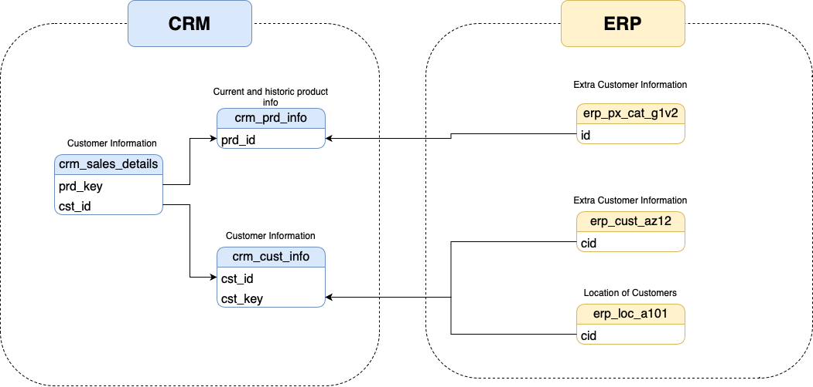
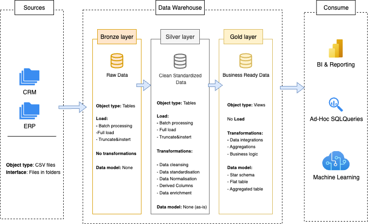
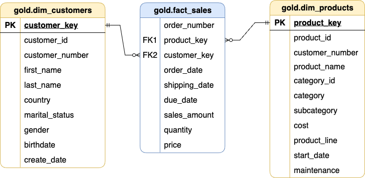

# data-warehouse-ecommerce

End-to-end Data Warehouse project simulating an e-commerce environment using PostgreSQL and local CSV files. Follows a layered architecture: Bronze, Silver, and Gold, going from raw data to analytical-ready datasets.

## Technologies

- PostgreSQL
- SQL (psql CLI for loading)
- VS Code
- Git + GitHub
- PGAdmin4

## Data Source Context

This project assumes a simplified e-commerce ecosystem where raw data is extracted from two systems:

- **ERP** (Enterprise Resource Planning): Provides product inventory, pricing, and orders.
- **CRM** (Customer Relationship Management): Provides customer profiles and behavior.

These systems feed raw CSV exports which simulate extracts from operational systems. Data is ingested into the Bronze layer **without prior cleaning**, and then transformed downstream.

`

## Architecture Overview

This project follows a modern layered architecture used in data engineering:

- **Bronze**: Raw data ingestion (CSV to PostgreSQL via `\copy`)
- **Silver**: Cleaned and transformed data (type casting, null handling, deduplication)
- **Gold**: Dimensional model (fact and dimension tables)



## Entity-Relationship Model

Below is the simplified schema showing relationships between dimensions and fact tables in the Gold layer (star schema).

`

## Data Flow

1. CSV files are loaded into Bronze tables.
2. SQL transformations clean and load the data into Silver.
3. Dimensional modeling creates the Gold layer using SQL views.

## How to Run

1. Create the database:
 ```data_warehouse```
2. Create schemas and tables:

```psql -U <your_username> -d data_warehouse -f scripts/setup/create_schemas.sql```

```psql -U <your_username> -d data_warehouse -f scripts/bronze/create_bronze.sql```

```psql -U <your_username> -d data_warehouse -f scripts/silver/create_silver.sql```

3. Load raw CSVs into Bronze layer:

```psql -U <your_username> -d data_warehouse -f scripts/bronze/load_bronze.sql```

4. Transform data to Silver layer:

```psql -U <your_username> -d data_warehouse -f scripts/silver/transform_to_silver.sql```

5. Create gold views

```psql -U <your_username> -d data_warehouse -f scripts/gold/gold_layer_views.sql```

## Learnings

- SQL-based ETL architecture using layered design
- Using \copy for local ingestion
- Dimensional modeling with star schema
- Workflow organization using scripts

## Author

Eduardo Galaz
https://github.com/Eduardogalaz
